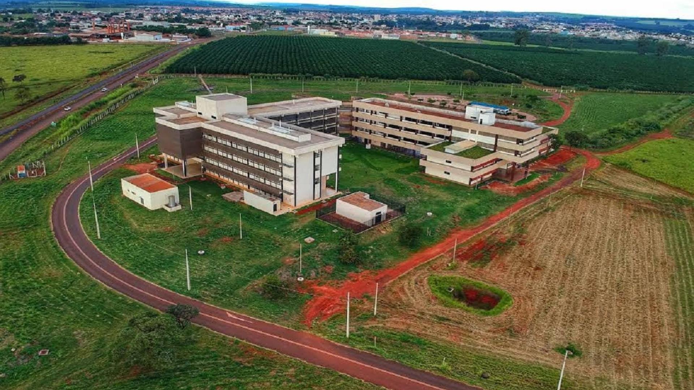

# Universidade - UFU

Aqui estão todos os exercícios e projetos que estou desenvolvendo atualmente na universidade. Eles organizados em pastas, cada uma com o nome da disciplina correspondente e com os exercícios e projetos finais.

Imagem - UFU</img>

<!-- Data: 02/04/2025

<!DOCTYPE html>
<html lang="pt-br">
<head>
    <meta charset="UTF-8">
    <meta name="viewport" content="width=device-width, initial-scale=1.0">
    
    <title>Exercício 0</title>
</head>
<body>

</body>
</html>
-->